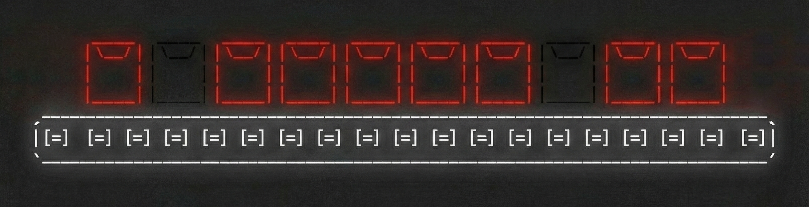

# Part 1: The Stack Segmentation

Your first task is to fix the stacking protocol by instructing the robotic arm to efficiently stack totes from the main
conveyor belt into a single vertical stack.

The totes arrive in a single, continuous stream. The arm needs to group consecutive totes into vertical **Stacks**. To
conserve energy, the arm should pick up as many totes at once as possible, ideally 4 totes per stack. Picking up fewer
totes causes higher energy consumption and risks overheating the servo-motors.

### The Input

[Your puzzle input](./INPUT) is a single line representing the stream of incoming totes. Each tote is separated by a
single space. A tote is defined by a **Type** and a **Weight**.

* **Type:** `A` (Ambient), `C` (Chilled), `F` (Frozen).
* **Weight:** An integer (e.g., `05`, `12`, `20`).

**Example Input:**

```text
A10 C08 F05 A20 A20 C10
```

### The Stacking Rules

You must divide the entire stream into contiguous segments to form valid Stacks.

1. **Capacity:** A stack can contain **1 to 4** totes.
2. **Thermodynamic Integrity:** You cannot place a colder tote on top of a warmer tote.
    * $Temp(A) > Temp(C) > Temp(F)$
    * *Illegal:* `C` on top of `A`.
    * *Legal:* `C` on `F`, `A` on `F`, or `A` on `A`.
3. **Gravity Stability:** You cannot place a heavier tote on top of a lighter tote.
    * $Weight_{top} \le Weight_{below}$

### The Handling Cost

To save energy, you want to maximise the size of your stacks. The cost is determined by the size of the stack you
create:

* **Stack of 1:** Cost **50** (High inefficiency)
* **Stack of 2:** Cost **25**
* **Stack of 3:** Cost **10**
* **Stack of 4:** Cost **0** (Perfect efficiency)

### Your Mission

Process the stream from start to finish. Determine the optimal places to "cut" the stream into stacks such that the
**Total Handling Cost** is minimised.

### Example:

Stream: `A20 A20 A20 A20 A20`

* *Option 1:* Five stacks of 1. Cost: $5 \times 50 = 250$.
* *Option 2:* One stack of 4, one stack of 1. Cost: $0 + 50 = 50$.
* *Option 3:* One stack of 3, one stack of 2. Cost: $10 + 25 = 35$.

In this example, the minimum cost is **35**.

**What is the minimum Handling Cost for your puzzle input?**

-----

~~Your answer:~~ _______________

For answer reach out to `@marko` on [Slack](https://picnic.enterprise.slack.com/team/U07L5RH4VH6).

Did you get it right? Proceed to [part 2](./PART_2.md)